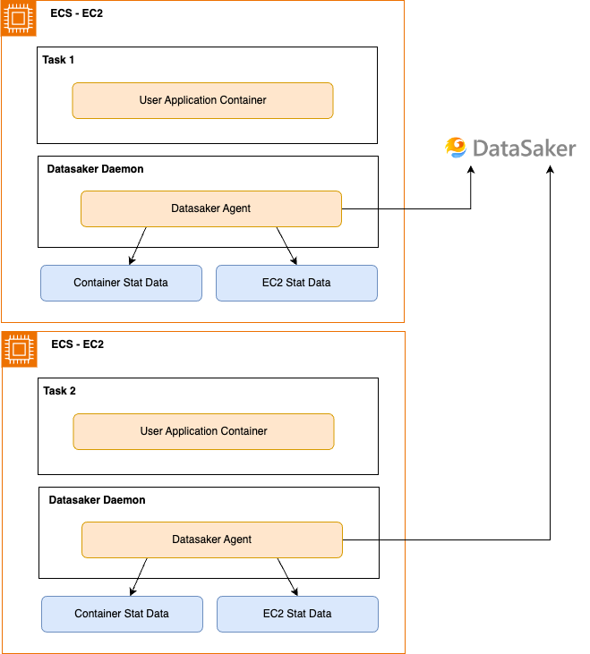

# 설치하기

데이터세이커 ECS 에이전트는 ecs의 스탯 정보와 메타데이터 정보를 통해 컨테이너와 인스턴스 별 자원 사용량을 실시간으로 수집합니다. 이를 통해 CPU, 메모리 사용량, 네트워크 트래픽 등의 성능 지표들을 확인 할 수 있습니다.

dsk-ecs-agent는 EC2 인프라를 사용하는 ECS 클러스터에서만 사용할 수 있습니다.
Fargate 으로 배포된 어플리케이션과 서버의 성능을 확인하기 위해선 [다음](./fargate.md) 페이지를 확인해주세요.

## 사전 요구사항

에이전트는 다음 주소로 데이터를 보낼 수 있어야 합니다. 해당 주소로 통신이 가능한지 확인해주세요.

- `gate.kr.datasaker.io:31302`
- `api.kr.datasaker.io`

## 설치 방법



ECS 내의 EC2 인스턴스와 컨테이너들을 모니터링 하기 위해서, 데이터세이커 에이전트는 데몬셋으로 배포되어야 합니다.
다음 단계를 따라 에이전트를 배포할 수 있습니다.

### Web UI로 배포하기

#### 태스크 정의 만들기

web ui로 Agent를 배포하는 방법은 다음과 같습니다.

1. AMAZON ELASTIC CONTAINER SERVICE > 태스크 정의 > 새 태스크 정의 생성
2. 컨테이너의 이름에 `datasaker-agent`를 입력합니다.
3. 이미지에 URI에 `datasaker/dsk-ecs-agent` 를 입력합니다.
4. 환경 변수 항목의 `환경 변수 추가`를 클릭합니다.
5. 키 항목에 `DSK_GLOBAL_API`를, 값 항목에 데이터세이커의 API key를 입력합니다.
6. 스토리지 항목에서 다음 세 가지 볼륨을 추가합니다.

   | 볼륨 유형  | 볼륨 이름       | 소스 경로                |
       |--------|-------------|----------------------|
   | 바인드 탑재 | docker_sock | /var/run/docker.sock |
   | 바인드 탑재 | proc        | /proc/               |
   | 바인드 탑재 | rootfs      | /                    |

7. 스토리지 항목에서 다음 세 가지 컨테이너 탑재 지점을 추가합니다.

   | 볼륨 이름       | 컨테이너 경로              | 읽기 전용 |
       |-------------|----------------------|-------|
   | docker_sock | /var/run/docker.sock | true  |
   | proc        | /host/proc           | true  |
   | rootfs      | /rootfs              | true  |

혹은 다음 json 파일을 참고하여 작업합니다.

```JSON
{
  "family": "datasaker-agent",
  "containerDefinitions": [
    {
      "name": "agent",
      "image": "datasaker/dsk-ecs-agent",
      "cpu": 100,
      "memory": 512,
      "essential": true,
      "environment": [
        {
          "name": "DSK_GLOBAL_APIKEY",
          "value": "$MY_API_KEY"
        }
      ],
      "mountPoints": [
        {
          "sourceVolume": "docker_sock",
          "containerPath": "/var/run/docker.sock",
          "readOnly": true
        },
        {
          "sourceVolume": "proc",
          "containerPath": "/host/proc",
          "readOnly": true
        },
        {
          "sourceVolume": "rootfs",
          "containerPath": "/rootfs",
          "readOnly": true
        }
      ]
    }
  ],
  "volumes": [
    {
      "name": "docker_sock",
      "host": {
        "sourcePath": "/var/run/docker.sock"
      }
    },
    {
      "name": "proc",
      "host": {
        "sourcePath": "/proc/"
      }
    },
    {
      "name": "rootfs",
      "host": {
        "sourcePath": "/"
      }
    }
  ]
}
```

#### 태스크 정의 배포하기

에이전트를 데몬(Daemon) 형태로 각 인스턴스에 배포합니다. 에이전트는 이제 EC2 내에서 함께 동작하며 메트릭을 수집 할 것입니다.
