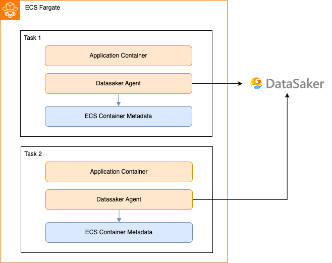

# 설치하기

데이터세이커 ECS 에이전트는 ecs의 스탯 정보와 메타데이터 정보를 통해 컨테이너 별 자원 사용량을 실시간으로 수집합니다. 이를 통해 CPU, 메모리 사용량, 네트워크 트래픽 등의 성능 지표들을 확인 할 수 있습니다.

dsk-fargate-agent는 Fargate LunchType을 사용하는 ECS 클러스터에서만 사용할 수 있습니다.
EC2 Lunch Type으로 배포된 어플리케이션과 서버의 성능을 확인하기 위해선 [다음](./ec2.md) 페이지를 확인해주세요.

## 사전 요구사항

에이전트는 다음 주소로 데이터를 보낼 수 있어야 합니다. 해당 주소로 통신이 가능한지 확인해주세요.

- `gate.kr.datasaker.io:31302`
- `api.kr.datasaker.io`

## 설치 방법



ECS Fargate 내의 컨테이너들을 모니터링 하기 위해서, 데이터세이커 에이전트는 같은 **`task definition`** 내에 배포되어야 합니다.
다음 단계를 따라 에이전트를 배포할 수 있습니다.

### Web UI로 배포하기

#### 태스크 정의 만들기

web ui로 Agent를 배포하는 방법은 다음과 같습니다.

1. AMAZON ELASTIC CONTAINER SERVICE > 태스크 정의 > 새 태스크 정의 생성
2. 컨테이너의 이름에 `datasaker-agent`를 입력합니다.
3. 이미지에 URI에 `datasaker/dsk-fargate-agent` 를 입력합니다.
4. 환경 변수 항목의 `환경 변수 추가`를 클릭합니다.
5. 키 항목에 `DSK_GLOBAL_API`를, 값 항목에 데이터세이커의 API key를 입력합니다.
6. 배포할 어플리케이션 컨테이너의 설정을 입력후, 태스크를 생성합니다.

#### 태스크 정의 배포하기

Fargate를 Replica Service로 배포합니다. 에이전트는 이제 태스크 내에서 어플리케이션 컨테이너화 함께 동작하며, 컨테이너의 메트릭을 수집 할 것입니다.

### CloudFormation으로 배포하기

다음 설정을 참고하세요

```yaml
version: '3'
services:
YOUR_APP:
  image: YOUR_APP_IMAGE
  ...생략...
datasaker-agent:
  image: datasaker/dsk-fargate-agent
  environment:
    - DSK_GLOBAL_API=$YOUR_API_KEY
```
